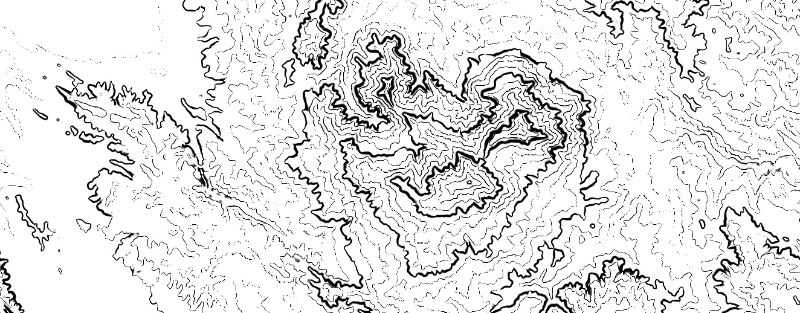

Visual technology, digital cartography, prototypes, R&D, and miscellaneous hackery from designer Peter Richardson.

<mark>Currently</mark>: Freelance. <mark>Formerly</mark>: Okta, Esri, Snap, Mapzen, and dozens of animation and advertising studios for hundreds of clients including Microsoft, Disney/Pixar, Sony, Rockstar Games, Hershey, Frito-Lay, LEGO, Comedy Central, and Sesame Street.

<a href="https://meetar.github.io/reverse-parallax-shader/">

Crystal Shader

</a>

<!--
<a href="">

  Audubon Bird Explorer
  

</a>
-->

<a href="case-studies#pathfinder">

Graph Pathfinder

</a>

<a href="case-studies#musicmap">

Music Map

</a>

<!--
<a href="">

Bendix Sapphire

</a>
-->

<a href="http://meetar.github.io/gem-collector">

Gem Collector

</a>

<a href="/fake-rock">

Fake Rock

</a>

<a href="/plotter">

Plotter Prints

</a>

<a href="http://tangrams.github.io/heightmapper">

Heightmapper

</a>

<a href="https://tangrams.github.io/terrain-demos/?url=styles/green-stdev.yaml#10/57.0719/-126.2290">

Standard Deviation Map

</a>

<a href="https://tangrams.github.io/terrain-demos/?url=styles/green-selectiveblur.yaml#10/57.0719/-126.2290">

Adaptive Generalization

</a>

<a href="https://tangrams.github.io/terrain-demos/?url=styles/contours.yaml#12/37.8773/-121.9290">

Animated Contours

</a>

<a href="https://meetar.github.io/projection-tests/?katamari.yaml#15/40.7477/-73.9866">

NYC Katamari

</a>

<a href="https://meetar.github.io/heightmap-demos/adaptive.html">

Adaptive Relief Map

</a>

<a href="http://meetar.github.io/elevator">

Elevator

</a>

<a href="https://tangrams.github.io/carousel/?daynight#15/40.7076/-74.0094">

Day/Night Map

</a>

<a href="https://tangrams.github.io/kinkade/">

Kinkade Terrain Painter

</a>

<a href="https://meetar.github.io/globe-terrain/">

Global Terrain

</a>

<a href="https://meetar.github.io/albers/">

Albers Projection

</a>

<a href="https://meetar.github.io/bendy-map/">

Bendy Map

</a>

<a href="https://meetar.github.io/siggraph-maps/?palms.yaml/#15">

Palms

</a>

<a href="https://meetar.github.io/siggraph-maps/?galaxy.yaml/#15">

Galaxy

</a>

<a href="https://meetar.github.io/siggraph-maps/?1988.yaml/#15">

1988

</a>

<a href="https://tangrams.github.io/explorer/#14.0/40.7238/-73.9881/kind/major_road">

OSM Explorer

</a>

<a href="/makerbot-mountains">

Makerbot Mountains

</a>

<a href="https://github.com/meetar/dotmap">

Dotmap
(Contributor)

</a>

<a href="https://mapzen.com/products/tangram/">

Tangram
(Contributor)

</a>

<a href="https://github.com/meetar/littlebits-r2d2-controls">

Littlebits R2D2

</a>

<!-- <a href="https://github.com/meetar/manhattan-project">

Manhattan Project

</a> -->

<a href="/pancakes">

Biz Markie

</a>

<a href="/fritolay">

Frito-Lay

</a>

<a href="/formline">

Formline

</a>

<a href="/spacebunnies">

Space Bunnies

</a>

<a href="/matrix">

Matrix: Revolutions

</a>

<a href="https://vimeo.com/manage/videos/79354708">

VDZ Year

</a>

Latest posts:

  <ul class="post-cards">
    
    
    
      <a class="post-link" href="{{ post.url | prepend: site.baseurl }}" aria-label="{{ post.aria-label }}">
<li class="post-card">
          <h2>
            {{ post.title }}
          </h2>
          {{ post.date | date: "%-d %b %Y" }}
          
      
      
          

          {{ post.excerpt | remove: '
' | remove: '
' }}

        </li>
</a>
        
    
  </ul>

